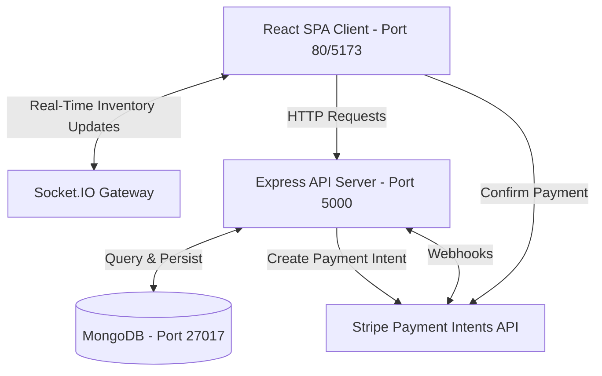

# ShopStream 🛍️

[](https://github.com/NileshKonkankar/shopstream/actions/workflows/ci.yml)
[](https://opensource.org/licenses/MIT)
[](https://nodejs.org)
[](https://www.typescriptlang.org/)

ShopStream is a production-grade, highly responsive full-stack e-commerce platform designed with micro-animations, real-time inventory synchronization, and a secure Stripe checkout process. Built on the MERN stack (MongoDB, Express, React, Node.js), it models enterprise practices such as secure server-side recalculations, strict Zod input validation, role-based route protection, robust TypeScript type safety, and real-time client socket notifications.

---

## 🚀 Key Features

* **JWT-Based Authentication**: Secure login and sign-up with access tokens stored in-memory and securely managed via HTTP cookies/sessions.
* **Role-Based Authorization**: Distinct routes, layouts, and permissions for `customer` and `admin` users.
* **Real-time Inventory Sync**: Instant product stock updates across all active customer browsers using Socket.IO whenever an admin updates inventory or an order is completed.
* **Secure Checkout with Stripe**: Client-side Stripe Elements integrated with a backend Stripe Payment Intents flow, executing secure server-side cost recalculations in Indian Rupees (₹) to prevent client-side price tampering.
* **Interactive Shopping Cart**: Robust cart management with real-time stock-out warnings, quantity validation, and smooth animations.
* **Admin Dashboard**: Dedicated portal for admins to manage active catalogs, track products, and audit stock levels.
* **Recruiter-Friendly Developer Setup**: Comprehensive testing suite (Vitest + Jest), monorepo-ready configurations, optimized Docker Compose settings, and a automated CI/CD pipeline.

---

## 🛠️ Tech Stack

### Frontend
* **React 18** (Vite SPA)
* **TypeScript** for strict static-typing
* **Tailwind CSS** for modern utility-first layouts
* **TanStack Query (React Query)** for server-state caching & synchronization
* **Zustand** for lightweight, persistent global state management (auth and cart)
* **Socket.IO Client** for active duplex server connections

### Backend
* **Node.js** & **Express** with TypeScript compilation
* **MongoDB** & **Mongoose ODM** for document schema modeling
* **JSON Web Tokens (JWT)** & **Bcrypt** for secure auth & hashing
* **Socket.IO** for event-driven real-time server broadcasts
* **Stripe SDK** for intent creation and transaction operations

### DevOps, Testing & Tooling
* **Jest** & **Supertest** for comprehensive API integration tests
* **Vitest** & **React Testing Library** for frontend component and page state testing
* **Docker** & **Docker Compose** for instant local containerization
* **GitHub Actions** for automated multi-package CI/CD workflows
* **ESLint** & **Prettier** for unified formatting and code-style compliance

---

## 📐 Architecture Overview



1. **React Frontend**: Communicates with the Express API server and establishes a persistent duplex connection with the Socket.IO server.
2. **Express API**: Handles core business logic, user authentication, inventory validation, and communicates with MongoDB.
3. **MongoDB**: Serves as the high-performance document store for users, products, carts, and order entries.
4. **Stripe Payments**: Secures payments by calculating the total server-side, returning a transaction `client_secret` to the client, and confirming the order after successful webhooks or intent resolution.
5. **Real-time updates**: Emits transactional inventory state reductions via Socket.IO, updating all active shoppers' views instantly.

---

## 📂 Folder Structure

```
shopstream/
├── .github/
│   └── workflows/
│       └── ci.yml             # Main GitHub Actions CI/CD Pipeline
├── client/                     # Frontend Application
│   ├── src/
│   │   ├── api/               # API clients (axios, endpoints)
│   │   ├── components/        # Presentational and layout components
│   │   ├── pages/             # Route-level views (Products, Cart, Admin)
│   │   ├── routes/            # Route guards (ProtectedRoute, AdminRoute)
│   │   ├── store/             # Zustand state management (auth, cart)
│   │   ├── tests/             # Unit and integration test suites (Vitest)
│   │   └── types/             # Common TypeScript interfaces
│   ├── Dockerfile             # Multi-stage production Nginx dockerfile
│   ├── nginx.conf             # Custom Nginx configuration for SPA routing
│   └── package.json
├── server/                     # Backend API Application
│   ├── src/
│   │   ├── config/            # DB, Env, and Stripe initializers
│   │   ├── controllers/       # Controller logic (Auth, Cart, Orders, Payments)
│   │   ├── middleware/        # Middlewares (Auth, Error, Logger, Zod)
│   │   ├── models/            # Mongoose Schemas (User, Product, Cart, Order)
│   │   ├── routes/            # REST endpoint configurations
│   │   ├── sockets/           # Socket.IO handlers
│   │   ├── tests/             # Jest and Supertest integration tests
│   │   └── validations/       # Zod verification schemas
│   ├── Dockerfile             # Multi-stage production Alpine runner dockerfile
│   └── package.json
├── docker-compose.yml          # Local orchestration config for full application
├── .gitignore                  # Monorepo-level git ignores
└── README.md                   # Root Documentation
```

---

## ⚙️ Environment Variables

### Backend (`server/.env`)
Create a `server/.env` file in the server root folder:
```env
PORT=5000
NODE_ENV=development
MONGO_URI=mongodb://localhost:27017/shopstream
JWT_SECRET=your_jwt_secret_key_here
JWT_EXPIRES_IN=7d
CLIENT_URL=http://localhost:5173
STRIPE_SECRET_KEY=sk_test_your_secret_key
STRIPE_WEBHOOK_SECRET=whsec_your_webhook_secret
CURRENCY=INR
```

### Frontend (`client/.env`)
Create a `client/.env` file in the client root folder:
```env
VITE_API_URL=http://localhost:5000
VITE_STRIPE_PUBLISHABLE_KEY=pk_test_your_publishable_key
```

---

## 🕹️ Setup Instructions

### Prerequisites
* **Node.js**: v20.x or above (LTS)
* **MongoDB**: A running local MongoDB instance or a MongoDB Atlas URI
* **Stripe Account**: A free developer account to obtain testing keys

### Option A: Standard Manual Setup

1. **Clone the repository**:
   ```bash
   git clone https://github.com/yourusername/shopstream.git
   cd shopstream
   ```

2. **Configure Environment Variables**:
   * Create `server/.env` using the server `.env.example`.
   * Create `client/.env` using the client `.env.example`.

3. **Install Dependencies & Run Backend**:
   ```bash
   cd server
   npm install
   npm run dev
   ```
   *The server will start on `http://localhost:5000`.*

4. **Install Dependencies & Run Frontend**:
   ```bash
   cd ../client
   npm install
   npm run dev
   ```
   *The frontend dev server will launch on `http://localhost:5173`.*

---

### Option B: Seamless Docker Setup 🐳
Orchestrate MongoDB, the Express backend, and the React frontend inside an isolated Docker container cluster using a single command:

```bash
docker-compose up --build
```
* The React client will be built, Nginx-optimized, and hosted at `http://localhost`.
* The Express server runs internally and maps its API gateway to `http://localhost:5000`.
* A persistent MongoDB database container runs on `mongodb://localhost:27017`.

---

## 🔌 API Route Reference

| Method | Endpoint | Description | Auth Required |
| :--- | :--- | :--- | :--- |
| **POST** | `/api/auth/register` | Register a new user profile | None |
| **POST** | `/api/auth/login` | Login user and issue access JWT | None |
| **GET** | `/api/auth/me` | Fetch active user information | Customer/Admin |
| **GET** | `/api/products` | Fetch filtered catalog list (Search, Categories) | None |
| **POST** | `/api/products` | Create catalog item | Admin |
| **GET** | `/api/cart` | View current logged-in user's cart | Customer |
| **POST** | `/api/cart` | Add / increment items in shopping cart | Customer |
| **PUT** | `/api/cart` | Update individual cart quantities | Customer |
| **DELETE** | `/api/cart/:productId` | Remove item from cart | Customer |
| **POST** | `/api/payments/intent` | Initialize Stripe Payment Intent (Recalculated) | Customer |
| **POST** | `/api/orders` | Instantiate order from successful payment | Customer |

---

## ⚡ Critical Flows Explained

### 📊 Real-Time Inventory Sync Flow
1. **Purchase / Admin Edit**: A client completes a purchase (reducing stock) or an administrator updates stock levels via the Dashboard.
2. **Database Save & Broadcast**: The database record is updated, and the server triggers an inventory event:
   ```typescript
   io.emit("inventory:update", { productId, stock });
   ```
3. **Socket Listener**: Active web clients catch the event instantly.
4. **UI Reconciliation**: Zustand updates the cached state, prompting immediate visual reflections (e.g. quantity adjusters, buy buttons, or stock counts) without page refresh.

### 💳 Stripe Recalculation Flow
To prevent critical payment exploits, ShopStream uses a **zero-trust client pricing** architecture:
1. **Intent Request**: Customer requests checkout. The frontend sends the Cart items list to `/api/payments/intent`.
2. **Server-Side Verification**: The backend pulls price values for each item directly from MongoDB, recalculating the sum in Indian Rupees (₹) completely ignoring client-side values.
3. **Stripe Payment Intent**: Backend calls the Stripe SDK to register a transaction intent for the exact calculated sum.
4. **Token Generation**: Server returns a secure transaction `client_secret`.
5. **Secure Payment Confirmation**: Frontend safely confirms the checkout transaction against Stripe Elements using the secret token.

---

## 🛡️ Security Highlights

* **In-Memory JWT & Session guards**: Protects user state against Cross-Site Scripting (XSS) and CSRF attacks.
* **Rate Limiting**: Integrated `express-rate-limit` prevents brute-force login and API flooding.
* **Security Headers**: `helmet` is set up to block server header disclosures, cross-site scripting, and sniffing.
* **Bcrypt Password Hashing**: Safe one-way crypt hashes for password security.
* **Strict Payload Validations**: Zod schemas validate every incoming REST API payload, blocking database injection vectors.

---

## 🧪 Testing Suite

Automated testing is critical for portfolio validation. ShopStream includes comprehensive unit and integration tests achieving stellar code coverage.

### Backend Tests (Jest & Supertest)
Includes isolated database integrations, authentication checks, route protection, cart validations, and payment calculation mocks:
```bash
cd server
npm run test           # Run all backend suites
npm run test:coverage  # Generate coverage reports (>72% overall coverage)
```

### Frontend Tests (Vitest & React Testing Library)
Features comprehensive rendering checks, path routing protections, React Query hook mocks, and state-store updates:
```bash
cd client
npm run test           # Run Vitest runner
npm run test:coverage  # Generate frontend coverage report
```

---

## ⛵ Deployment
Recommended cloud deployment platforms:
* **Database**: [MongoDB Atlas](https://www.mongodb.com/products/platform/atlas-database) (Free Tier cluster)
* **Backend API**: [Render](https://render.com) (Configured with environment vars)
* **Frontend Web**: [Vercel](https://vercel.com)

---

## 🚀 Future Roadmap
* [ ] **AI-Powered Recommendations**: Personalized shopping suggestions using user search behaviors.
* [ ] **Product Wishlists**: Allow users to save products for later.
* [ ] **Elasticsearch Integration**: Advanced search with typeahead and search relevancy scoring.
* [ ] **Instant Web Push Notifications**: Alerts for restocking and major sales events.

---

## 📄 Resume Bullet Point for Freshers
> *“Architected and built a highly responsive MERN stack e-commerce application featuring real-time inventory synchronization via Socket.IO and a secure zero-trust checkout using Stripe Payment Intents API. Achieved high maintainability with structured TypeScript typing, created isolated tests via Jest/Vitest with >70% coverage, and constructed automated deployment workflows using multi-stage Dockerfiles and GitHub Actions.”*

---
